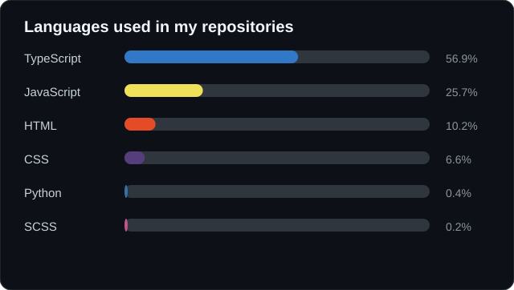
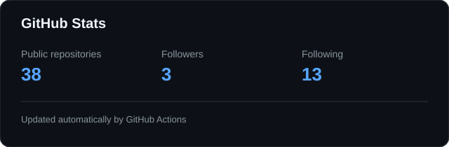

# 👋 Hi, I'm Mayra Montalvan

### Software Engineer · Backend · Cloud · AI

I'm a Software Engineer focused on building scalable, reliable, and maintainable technological solutions.

I enjoy designing backend systems, working with cloud infrastructure, exploring AI-powered applications, and turning complex problems into simple and effective solutions.

---

## 🧑‍💻 About Me

- 💻 Software Engineer focused on backend development
- 🚀 Interested in scalable and distributed systems
- ☁️ Experienced with AWS and cloud-based architectures
- 🤖 Exploring AI, LLMs and intelligent applications
- 🧩 Enjoy working with TypeScript, JavaScript and Python
- 🏗️ Interested in clean architecture, APIs and system design
- 📚 Always learning and experimenting with new technologies

---

## 🛠️ Tech Stack

### Backend

  
  
  
  

### Frontend

  
  
  

### Cloud & Infrastructure

  
  
  

### Databases & APIs

  
  
  

---

## 📊 GitHub Statistics

  
  

